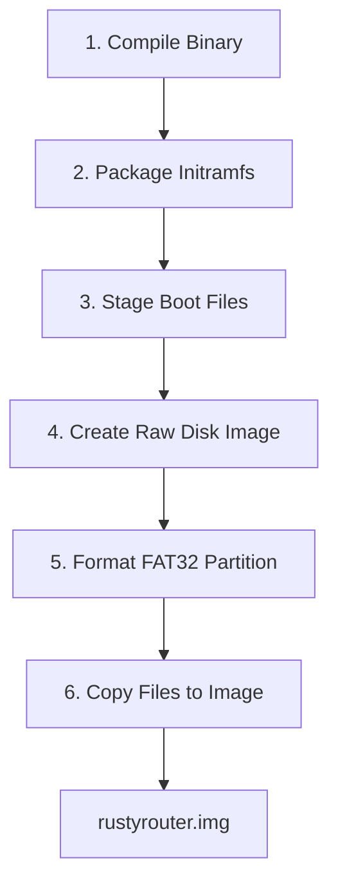

# Specification: Bootable SD Card Image Build Pipeline

This specification outlines the high-level process to compile, assemble, and package the static router binary, the Linux kernel, and the Broadcom GPU firmware into a single raw bootable SD card image file (`target/rustyrouter.img`).

By leveraging `mtools`, the entire pipeline runs in a **fully unprivileged environment** (no loop device mounts, no `chroot`, and no `sudo`/root access required).

---

## 1. High-Level Pipeline Stages

The automated build process is fully integrated into the `Makefile` and is executed via `make image`. It runs the following sequential phases:



### Phase 1: Compile Target Binary
- Adds the cross-compilation target (e.g. `aarch64-unknown-linux-musl` for Pi Zero 2/Pi 3) via `rustup`.
- Compiles the static MUSL release binary to ensure it does not require any dynamic linking libraries on the host.

### Phase 2: Package Initramfs Archive
- Prepares a clean staging directory matching the minimal Linux filesystem layout (`/bin`, `/dev`, `/proc`, `/sys`, `/run`, `/etc`).
- Copies the compiled binary as `/init` (enabling it to run as PID 1).
- Creates fallback basic device nodes (`/dev/console` and `/dev/null`) and packs the structure into a compressed GNU `cpio` archive (`target/pi_initramfs.cpio.gz`).

### Phase 3: Stage Boot Files
- Configures a sandboxed, unprivileged local **APT environment** (`target/apt`) pointing to the official Raspberry Pi package repositories.
- Imports the official archive public GPG signing key (`raspberrypi.gpg.key`), converting it to a local dearmored keyring.
- Runs `apt-get update` against the sandboxed config, verifying the GPG cryptographic signatures of the release indices.
- Securely downloads and extracts the verified **Raspberry Pi Kernel** (`raspberrypi-kernel`) and **Bootloader** (`raspberrypi-bootloader`) `.deb` packages.
- Extracts their payloads (`data.tar.*`) unprivileged using `ar` and `tar` to obtain the GPU firmware (`bootcode.bin`, `start.elf`, `fixup.dat`), kernels (`kernel.img`, `kernel8.img`), DTBs, overlays, and kernel modules.
- Stages these files alongside the compressed `pi_initramfs.cpio.gz`.
- Generates `config.txt` (sets 64-bit mode, maps initramfs load target) and `cmdline.txt` (defines serial redirect console, points root to `/dev/ram0` and init target to `/init`).

### Phase 4: Create Raw Disk Image
- Allocates an empty raw block file of `80MB` filled with zeros.
- Writes a Master Boot Record (MBR/msdos) partition table containing a single primary partition starting at a block-aligned offset of `1MiB`.

### Phase 5: Format FAT32 Partition
- Uses `mtools` (`mformat`) to format the partition inside the raw block file directly, referencing the block-aligned offset (`target/rustyrouter.img@@1M`).

### Phase 6: Copy Files to Image
- Uses `mtools` (`mcopy`) to recursively copy all firmware files, device tree blobs, overlays, configurations, kernels, and the initramfs archive directly into the FAT32 partition.

---

## 2. SD Card Partition Layout

The resulting raw disk image uses a standard layout to ensure Raspberry Pi firmware compatibility:

| Component | Offset | Size | Filesystem | boot flag |
| :--- | :--- | :--- | :--- | :--- |
| **MBR Partition Table** | `0` | `1 MiB` | - | - |
| **Primary Boot Partition** | `1 MiB` | `79 MiB` | FAT32 | Active (bootable) |

---

## 3. Flash to Hardware

Once the final image (`target/rustyrouter.img`) is created, it can be flashed directly onto a MicroSD card using any standard image-writing software (e.g. Raspberry Pi Imager, Rufus, or `dd` via command line):

```bash
sudo dd if=target/rustyrouter.img of=/dev/sdX bs=4M status=progress conv=fsync
```
*(Where `/dev/sdX` represents the target card reader block device).*

---

## 4. Testing the Image with QEMU

You can test the compiled kernel, initramfs, and disk image before flashing to physical hardware using QEMU.

### Method A: Emulating the Raspberry Pi 3 Board (Exact Emulation)
To emulate the actual Raspberry Pi 3 Board (`-M raspi3b`), QEMU requires the board's Device Tree Blob (`.dtb`) and the matching kernel:

```bash
qemu-system-aarch64 \
    -M raspi3b \
    -m 1024 \
    -kernel target/pi_boot/kernel8.img \
    -dtb target/pi_boot/bcm2710-rpi-3-b-plus.dtb \
    -drive file=target/rustyrouter.img,if=sd,format=raw \
    -append "console=ttyAMA0,115200 root=/dev/ram0 rdinit=/init quiet rustyrouter.wan=eth0 rustyrouter.lan=eth1 rustyrouter.lan_ip=192.168.1.1/24" \
    -nographic
```

> [!NOTE]
> QEMU's `raspi3b` machine does not support PCI, meaning standard virtual virtio ethernet adapters will not work. To test routing or DHCP capabilities, it is recommended to use Method B.

### Method B: Emulating a Generic ARM64 Virt Machine (Recommended for Routing Tests)
To test virtual networking, DHCP servers, and NAT firewall rules, boot using QEMU's generic `virt` machine. This allows mounting our static `initramfs` and kernel with full virtio PCI network card support:

```bash
qemu-system-aarch64 \
    -M virt \
    -cpu cortex-a53 \
    -m 1024 \
    -kernel target/pi_boot/kernel8.img \
    -initrd target/pi_boot/pi_initramfs.cpio.gz \
    -device virtio-net-pci,netdev=wan0 \
    -netdev user,id=wan0 \
    -device virtio-net-pci,netdev=lan0 \
    -netdev user,id=lan0 \
    -append "console=ttyAMA0 root=/dev/ram0 rdinit=/init quiet rustyrouter.wan=eth0 rustyrouter.lan=eth1 rustyrouter.lan_ip=192.168.1.1/24" \
    -nographic
```
*(Note: To boot QEMU's `-M virt`, ensure your `kernel8.img` or the host's generic arm64 kernel has the `CONFIG_VIRTIO_NET` and `CONFIG_PCI` options enabled).*

---

## 5. Makefile Target Quick Reference

| Command | Action | Description |
| :--- | :--- | :--- |
| `make` / `make all` | Build Host | Builds the static release binary and initramfs for the x86_64 host simulation. |
| `make qemu` | Run Host Sim | Boots the host simulation in QEMU (x86_64). |
| `make image` | Build Pi Image | Automatically runs the full pipeline to build `target/rustyrouter.img` for Raspberry Pi Zero/Zero2/3. |
| `make run-qemu` | Run Pi Sim | Boots the Raspberry Pi system in QEMU's ARM64 Virt Machine emulator. |
| `make clean` | Clean | Deletes all host and Raspberry Pi build targets, packages, caches, and raw images. |

